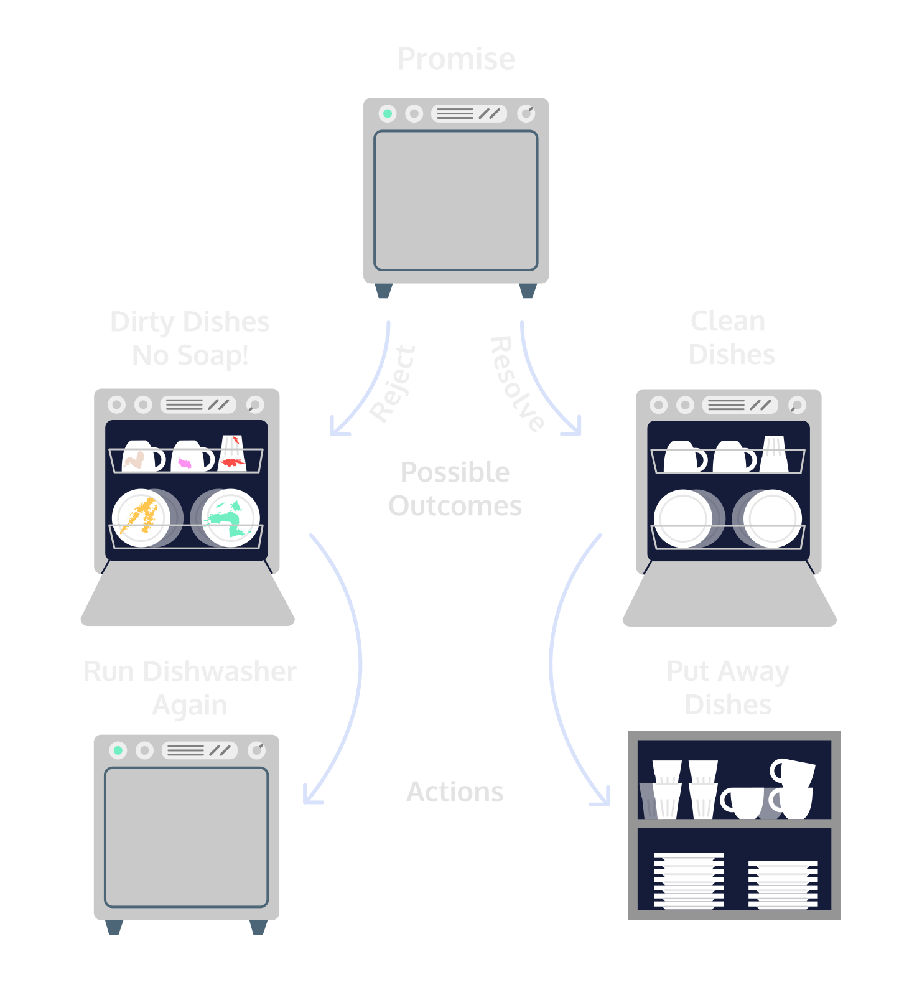

# Consuming Promises #

- [Index](../).
- [Previous The Node setTimeout() Function](./TheNodesetTimeout()Function).
- [Next Success and Failure Callback Functions](./SuccessAndFailureCallbackFunctions).

Consuming Promises
The initial state of an asynchronous promise is pending, but we have a guarantee that it will settle. How do we tell the computer what should happen then? Promise objects come with an aptly named .then() method. It allows us to say, “I have a promise, when it settles, then here’s what I want to happen…”

In the case of our dishwasher promise, the dishwasher will run then:

- If our promise rejects, this means we have dirty dishes, and we’ll add soap and run the dishwasher again.
- If our promise fulfills, this means we have clean dishes, and we’ll put the dishes away.
.then() is a higher-order function— it takes two callback functions as arguments. We refer to these callbacks as handlers. When the promise settles, the appropriate handler will be invoked with that settled value.

- The first handler, sometimes called onFulfilled, is a success handler, and it should contain the logic for the promise resolving.
- The second handler, sometimes called onRejected, is a failure handler, and it should contain the logic for the promise rejecting.
We can invoke .then() with one, both, or neither handler! This allows for flexibility, but it can also make for tricky debugging. If the appropriate handler is not provided, instead of throwing an error, .then() will just return a promise with the same settled value as the promise it was called on. One important feature of .then() is that it always returns a promise. We’ll return to this in more detail in a later exercise and explore why it’s so important.

;