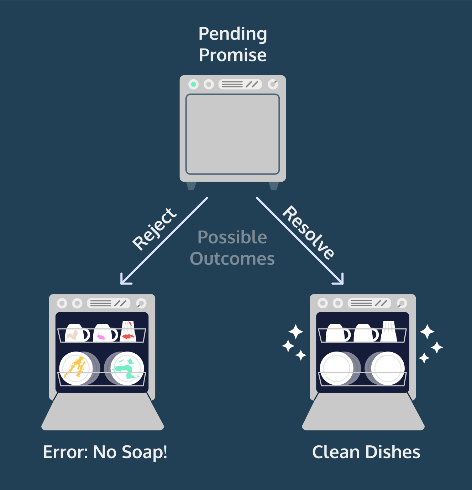

# What Is a Promise? #

- [Index](../).
- [Previous Introduction](../Introduction).
- [Next Constructing a Promise Object](../ConstructingAPromiseObject).

What is a Promise?
Promises are objects that represent the eventual outcome of an asynchronous operation. A Promise object can be in one of three states:

- Pending: The initial state— the operation has not completed yet.
- Fulfilled: The operation has completed successfully and the promise now has a resolved value. For example, a request’s promise might resolve with a JSON object as its value.
- Rejected: The operation has failed and the promise has a reason for the failure. This reason is usually an Error of some kind.
We refer to a promise as settled if it is no longer pending— it is either fulfilled or rejected. Let’s think of a dishwasher as having the states of a promise:

- Pending: The dishwasher is running but has not completed the washing cycle.
- Fulfilled: The dishwasher has completed the washing cycle and is full of clean dishes.
- Rejected: The dishwasher encountered a problem (it didn’t receive soap!) and returns unclean dishes.
If our dishwashing promise is fulfilled, we’ll be able to perform related tasks, such as unloading the clean dishes from the dishwasher. If it’s rejected, we can take alternate steps, such as running it again with soap or washing the dishes by hand.

All promises eventually settle, enabling us to write logic for what to do if the promise fulfills or if it rejects.

