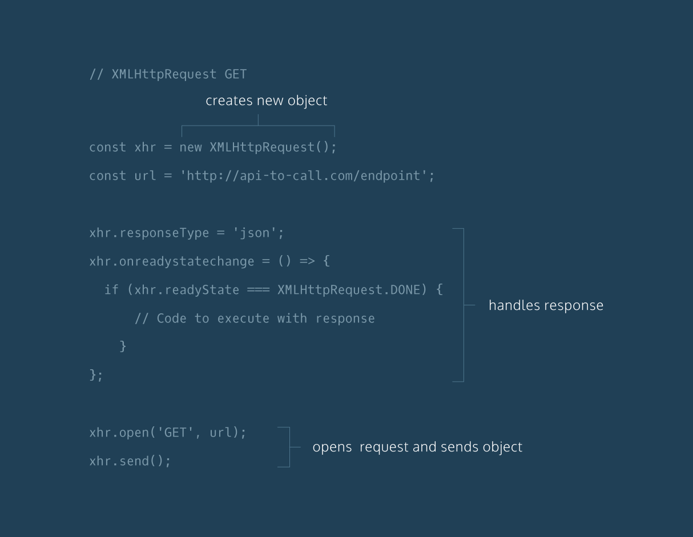

# XHR GET Requests 2#

- [Index](../).
- [Previous XHR GET Requersts](../XHRGETRequests).
- [Next 

We are going to reconstruct XHR GET request boilerplate code step-by-step until we have written a complete GET request.

Feel free to refer to the XHR GET diagram at any point while completing this exercise:

